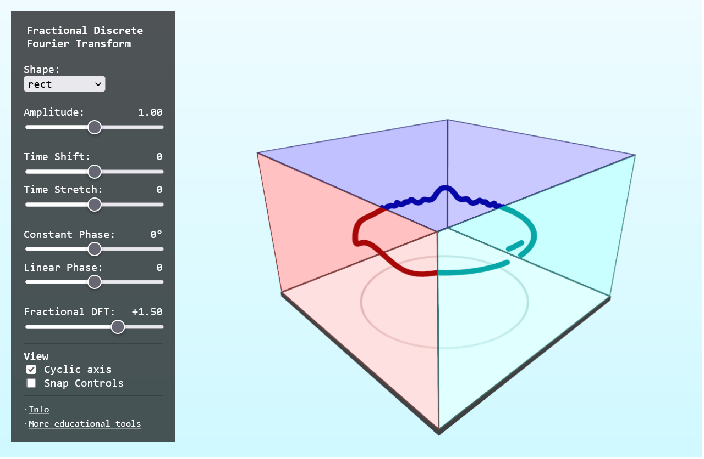

<<<<<<< HEAD
# FFT WASM

Discrete Fourier Transform in Svelte+ThreeJS+Rust+WASM



[Live Demo](https://static.laszlokorte.de/frft-cube/) | [Video Demo](https://www.youtube.com/watch?v=Xe2Ob1gPqlg)

## Build WASM module

```sh
wasm-pack build
```

## Run Webserver

```sh
yarn --cwd www run dev
```

## Build Webapp

```sh
yarn --cwd www run build
```

Output will be in `www/build`
=======
# FFT WASM

Discrete Fourier Transform in Svelte+ThreeJS+Rust+WASM


## Build WASM module

```sh
wasm-pack build
```

## Run Webserver

```sh
yarn --cwd www run dev
```

## Build Webapp

```sh
yarn --cwd www run build
```

Output will be in `www/build`
>>>>>>> caf1779 (extra frft implementaion in separate rust crate)
